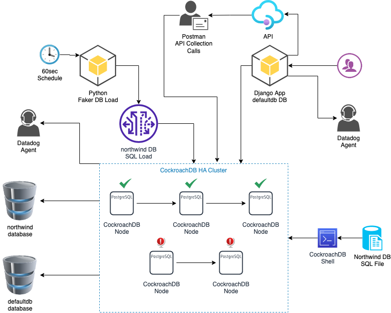

# CockroadchDB and Datadog

The current project details is located under the [`cockroachdb_datadog.md`](cockroachdb_datadog.md) markdown file.

## Getting started with the project

* Load the Northwind data set to the CockroachDB `northwind` database (create db manually before inserting data), see the example from Cockroach Labs [`Schema Design Database`](https://www.cockroachlabs.com/docs/stable/schema-design-database.html#example)
* Run the Northwind Django app docker-file.yaml (locally or remote within the same network)
  * Build the docker image for the application
  * change dir into `cd project/backend/apps/Northwind` and run `docker-compose up -d`
* Run the CockroachDB cluster
  * change dir into `cd project/database` and run `docker-compose up -d`
* Interfaces
  * Django App: [http://localhost:3000/](http://localhost:3000/)
  * Django REST API: [http://localhost:3000/crm/api/v1/](http://localhost:3000/crm/api/v1/)
  * CockroachDB: [http://localhost:8080/](http://localhost:8080/)

## Overview

