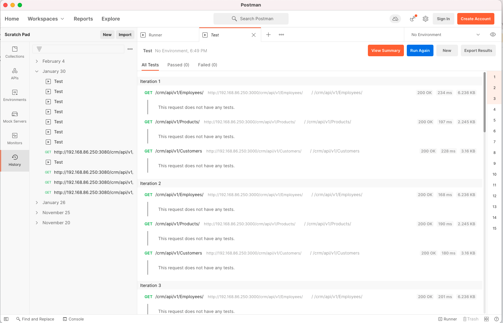
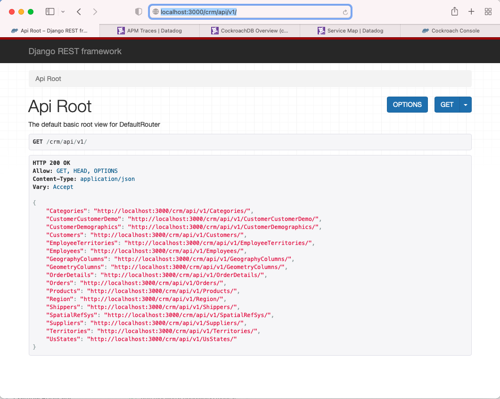
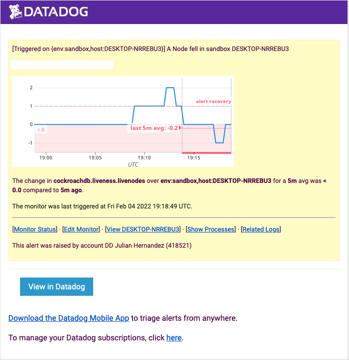
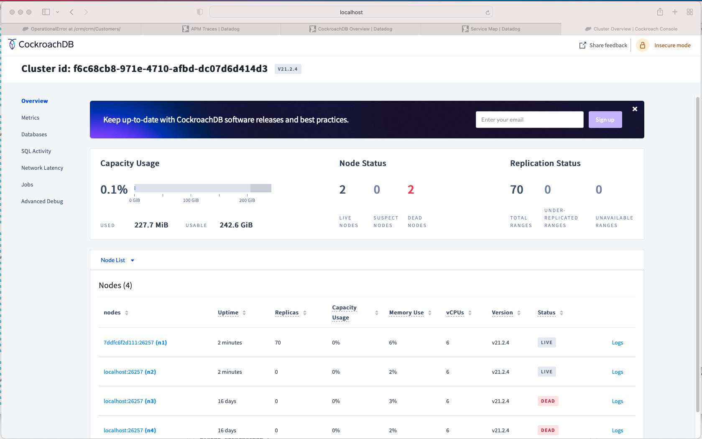
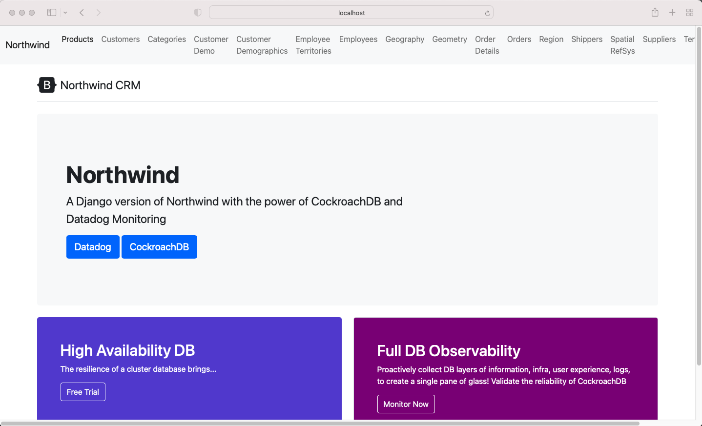
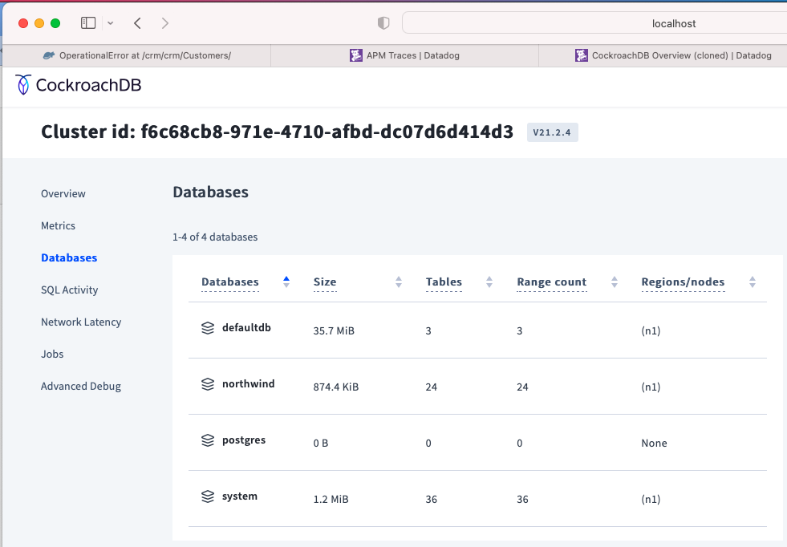
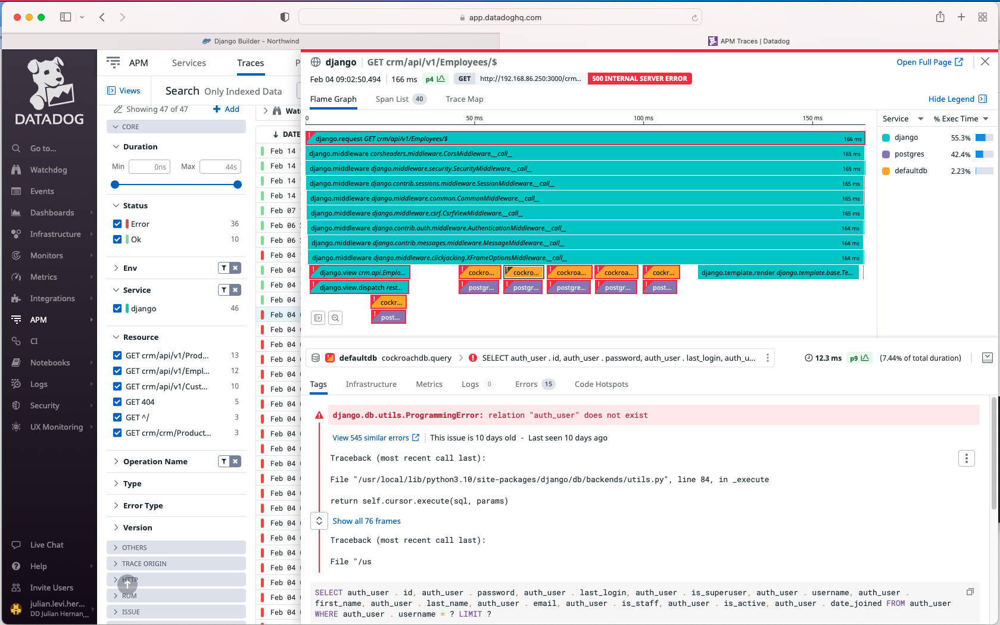
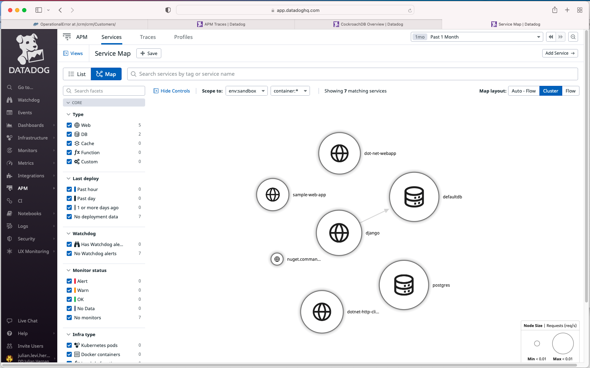
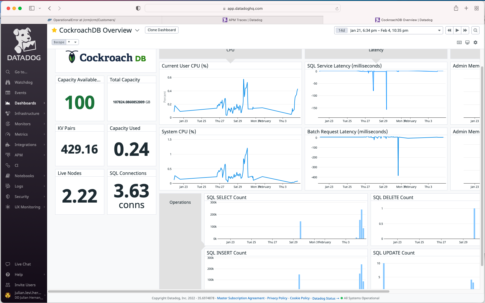

# CockroackDB + Datadog

According to the [`Cost of a Data Breach - A view from the cloud 2021` report](https://www.ibm.com/downloads/cas/JDALZGKJ), the average cost of hybrid and/or cloud security breached is to be $4.80 Million USD. The type of damage caused by a single security breach affects applications, network, servers, and the most important gold mine of every company: it's data storage. [Unitrends - What Are the Consequences of Data Loss? by Mark Campbell](https://www.unitrends.com/blog/what-are-the-consequences-of-data-loss) also has a breakdown of the risks and consequences of data loss, such as 93% filling for bankruptcy when data loss for over 10 days, that stems from multiple reasons. 

The risk of never reopening for business or paying high costs data recovery, is greater due to security threats or improperly (or not) monitored technology ecosystem.

## Objective

---

Through the following project focuses on two important aspects of the technology stack of companies, whether they are located on premise, cloud, or have a hybrid architecture. In the current project, we will focus on Cockroach DB scalability and the ability of Datadog to monitor the database for a full observability. The primary goal of the following writing is to highlight the advantages of each technology and not to discuss the comparison to other similar products or competitors; therefore we will not discuss what other competitors perceive as detractors for CockroachDB & Datadog.

### Why CockroachDB?

The name of the company and or product in itself is a head turning marketing strategy. Our common perception of cockroaches is that they can survive a nuclear blast and never die. Cockroach labs applies the same concept for the survival of the OLTP transactional data storage of every business: the database. For the readers who are familiar with the Hadoop distributed data computation, Cockroach Labs applies the evolution of distributed data with the Cockroach Database to ensure optimal availability, resiliency, and distributed data across geo-locations. 

**The Why: [Never worry about your database again](https://www.cockroachlabs.com/)**

* Resilience
* Distributed
* Quick time to deploy
* High Availability
* Omni-presence: Cloud (VMs, Functions, Managed), On-Prem, Hybrid
* Scalability
* [Transparent pricing & tiers](https://www.cockroachlabs.com/pricing/)
* more

### Why Datadog?

Having gone through the ringer, a common expression of rough/difficult experiences, with on-call duties, application development, database process redesign, overall systems monitoring, and endless 3 am false alert pager calls, I was able to understand how the criticality of seeing data in a single place for better decision making. 
Datadog's main concept is unification of monitored data to present an observability solution. More than just a single point solution, it uses one agent to turn on multiple monitoring tools (Network, Host Metrics, Live Process inventory, Log management, deep Database monitoring, security, and many more) and completes the full circle with over 500+ integrations and Cloud crawler integrations.

**The Why: [Modern monitoring & Security](https://www.datadoghq.com/)**

* Golden Signals & RED metrics for the entire ecosystem
* One agent install with multiple tools
  * CPU usage < 1% overall
  * eBPF event monitoring
  * Auto tagging
  * Multiple integrations (DBs, Big Data, JMX, and many more)
* SaaS platform
  * Every product is built from the ground up, rather than presenting siloed tools
* Robust rules, pipelines, offers
* ML + Watchdog
* Monitoring Out-of-the-box
* Out of the box Dashboards for most integrations
* Tag correlation
* [Transparent pricing & tiers](https://www.datadoghq.com/pricing/)
* more

## Project Integration Demo

To test the database cluster, we will use scripted data load, a Django interface, and Postman to make the API calls. Tools used in this project:

* [PyCharm CE](https://www.jetbrains.com/pycharm/download/)
* Git
* Python modules: random, [`Faker`](https://faker.readthedocs.io/en/master/), schedule, time, [`sqlalchemy`](https://pypi.org/project/SQLAlchemy/), [`pandas`](https://pypi.org/project/pandas/), Django, [`ddtrace`](https://pypi.org/project/ddtrace/), [`django-cockroachdb`](https://pypi.org/project/django-cockroachdb/), [`django-cors-headers`](https://pypi.org/project/django-cors-headers/), djangorestframework, psycopg2, psycopg2-binary, [`dj-database-url`](https://pypi.org/project/dj-database-url/)
* Docker, Docker Compose
* Remote VM to run CockroachDB cluster
* [Northwind](https://github.com/pthom/northwind_psql) SQL data set only for Django makemigrations.
* [Django Builder](https://djangobuilder.io/#/), to import the modules.py and generate the View and forms.
* [Postman Collection Runner](https://learning.postman.com/docs/running-collections/intro-to-collection-runs/)
* CockroachDB Docker Image
* Datadog Docker Image `datadog/agent`
* Datadog APM Python Library: [`ddtrace`](https://pypi.org/project/ddtrace/)

> Python packages

```commandline
pip install ddtrace dj-database-url \
Django \
django-cockroachdb \
django-cors-headers \
djangorestframework \
Faker \
psycopg2 \
psycopg2-binary \
requests \
schedule \
SQLAlchemy \
sqlalchemy-cockroachdb
```

The different databse package libraries are used for Django, Python, and SQL Alchemy. Django is not fully compatible with CockroachDB and the additional [`django-cockroachdb`](https://pypi.org/project/django-cockroachdb/) module is required.

**NOTE**: Whenever we see the Datadog flamegraphs, it will show two instances of a DB connection, which reflects the PostgreSQL driver and CockroachDB driver.

### Datadog API Key

Before we can continue with the successful database scalability and full observability, we need an account with Datadog and obtain an API key so we can send the monitoring information. Since we should not assign a hard coded key for the project, we will use environment variables to inject it to the docker-compose.yaml file as follows:

> Get an [API key](https://app.datadoghq.com/account/settings#api) after signing up for a free trial at [Datadog](https://www.datadoghq.com/)

```commandline
(venv) jlhernandez $ export DD_API_KEY=<dd api key hash>
```

The excerpt for the docker-compose.yaml for Datadog looks like the example below, there are more settings listed in the file:

```yaml
  datadog:
    image: datadog/agent
    links:
      - northwind
    environment:
      - DD_ENV=sandbox
      - DD_API_KEY=${DD_API_KEY}
```


### Database load script

Before getting started with stress testing of the CockroachDB cluster, we will use the following Python script that emits fake requests to insert new users into the database. Here is the breakdown of what the script accomplishes:

* Declare the connection url for the DB cluster via an env variable (used by Django):
```commandline
export DATABASE_URL="postgresql://root@localhost:26257/northwind?sslmode=disable"
```
* Random generate users based on the `Faker` Python module package, which provides random user data such as:
```python
>> faker.user_name(), faker.user_agent()
('rubengordon', 'Mozilla/5.0 (iPhone; CPU iPhone OS 9_3_5 like Mac OS X) AppleWebKit/532.2 (KHTML, like Gecko) FxiOS/15.1j8991.0 Mobile/45C281 Safari/532.2')
```
* With the Schedule module, we assign a random insertion database load range of 1-10K records every minute in our Python [`main`]("project/backend/data_emulator/main.py") function:
```python
if __name__ == '__main__':
    db_uri = "cockroachdb://root@192.168.86.214:26257/defaultdb?sslmode=disable"

    # Submit load test every 1 min: with a range of users from/up-to 1-50 where a=50 and 1 is hardcoded by default
    schedule.every(1).minutes.do(purchases, args=[10000, db_uri])
```

> Execute the scheduled workload to insert DB records from 1 to 10K records per minute.

```commandline
(venv) jlhernandez $ python project/backend/data_emulator/main.py 
```

### Cockroach Labs Database Test

To test the capabilities of CockroachDB, there are a few samples provided by Cockroach Labs on how to do a quick start, such as the in-memory database cluster, Kubernetes Helm chart, Docker container, and self-managed installations.

For our demo purposes, I have configured the following docker-compose.yaml file to test the `Elastic Scale` of the architecture. To get started, lets breakdown our approach:

* Run the initial deployment, then add nodes in the following order:
    * Master
    * Node 1

> Spin up a small CockroachDB cluster
```commandline
export NODE=node_1; export JOIN=master,${NODE}; docker-compose --verbose up
```

> Apply a database load via the Python emulator
```commandline
(venv) jlhernandez $ python project/backend/data_emulator/main.py 
```

> Apply a database load via API with Postman


The Django API receives Postman batch calls and hits different endpoints.


> Scale up the CockroachDB cluster to 5 nodes
```commandline
export NODE=node_5; export JOIN=master,node_1,node_2,node_3,node_4,${NODE}; docker-compose scale node=5
```

> Scale down the CockroachDB cluster to 3 nodes
```commandline
export NODE=node_2; export JOIN=master,node_1,${NODE}; docker-compose scale node=2
```

> Datadog notification when nodes fall


The approach taken with docker-compose is for testing purposes and are not fit for a production workload.

> CockroachDB Console Metrics


Results: CockroachDB shows the Elastic Scaling by providing a High Availability cluster to ensure no downtime  and no data loss is experienced via the un-killable design. 

### Backend/Frontend: Northwind Django app

* With the northwind.sql file, run it in CrockroachDB to seed the DB.
* Use Django migrate to infer the crm/models.py
* Use Django Builder to auto generate the front end views, forms, api, serializers, urls, and admin Django files
* Force a fake migration in Django to bypass creating a new structure from Django

* Testing the connection from Django to CockroachDB cluster

```sqlite-psql
(venv) jlhernandez $ python manage.py dbshell
#
# Welcome to the CockroachDB SQL shell.
# All statements must be terminated by a semicolon.
# To exit, type: \q.
#
# Server version: CockroachDB CCL v21.2.4 (x86_64-unknown-linux-gnu, built 2022/01/10 18:50:15, go1.16.6) (same version as client)
# Cluster ID: f6c68cb8-971e-4710-afbd-dc07d6d414d3
#
# Enter \? for a brief introduction.
#
root@localhost:26257/defaultdb> show databases;
  database_name | owner | primary_region | regions | survival_goal
----------------+-------+----------------+---------+----------------
  defaultdb     | root  | NULL           | {}      | NULL
  northwind     | root  | NULL           | {}      | NULL
  postgres      | root  | NULL           | {}      | NULL
  system        | node  | NULL           | {}      | NULL
(4 rows)


Time: 11ms total (execution 9ms / network 2ms)

root@localhost:26257/defaultdb> quit
```

> Starting the Django App
```commandline
(venv) jlhernandez $ python manage.py runserver 0:3000
```

> Frontend user interaction with the Northwind data set


> CockroachDB databases


### Datadog Monitoring Test

The objective of achieving full observability with Datadog are to ensure all data points are in a single context with correlated tags. The time to value is obtained by integrating Datadog with CockroachDB and obtain metrics from the database as well as the architecture in which it runs.

Within the Datadob platform, any CockroachDB user should be able to quickly understand the performance of the database, the elastic scalability as loads need to grow or decrease, and obtain ML analysis when a node dies, patterns are anomalous, and finally reduce false alert notifications. The core data obtained by Datadog ranges from Host & DB Logs, Network flow, Infra metrics, Live process, Database metrics, App traces for a 360 degree observability and single pane of glass.

The monitoring information we need as the cluster scales up or down are:

* Number of nodes alive
* Alerts produce during the change of node state
* Database performance throughout the process
* Query performance during load and app transactions
* Quick time to detection with the Database and surrounding ecosystem (apps, infra, memory, cpu, network, etc.)

> Tracing Django application + CockroachDB calls with Datadog APM

In general, tracing in Django is achieved with the following command:
```commandline
DD_SERVICE="api" DD_ENV="cockroach-sandbox" DD_LOGS_INJECTION=true ddtrace-run python3 manage.py runserver 0.0.0.0:8000
```

 

> Tracing Django application + CockroachDB calls with Datadog APM Service Map


> Full CockroachDB observability with Datadog Single Pane of Glass Dashboard


## Summary

Datadog's full unified observability and Cockroach Labs high availability are a strong set of solutions to quickly scale up and understand the correlation of each business unit processed, this brings quick MTTD, MTTR, availability, resilience, and many more benefits for businesses in need of quick growth.